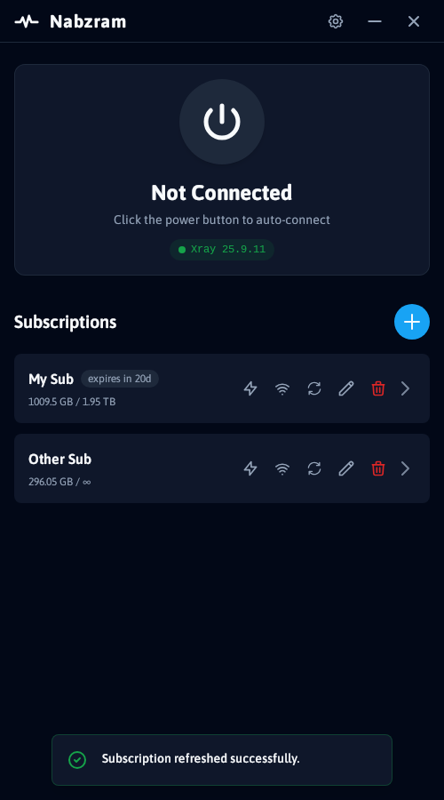
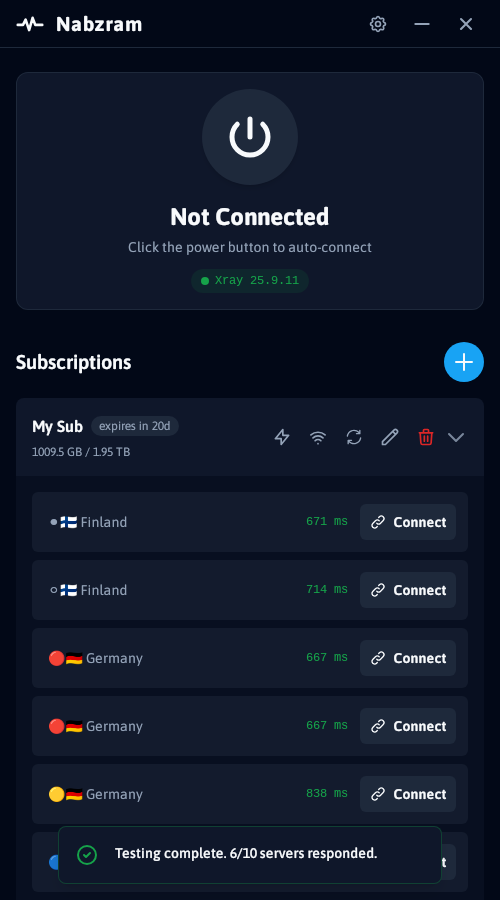
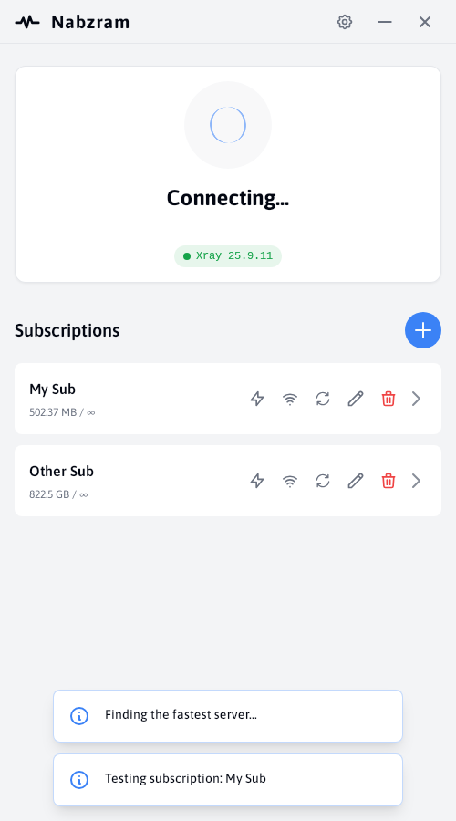
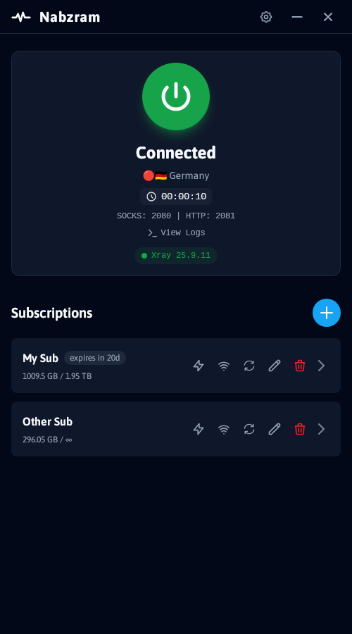
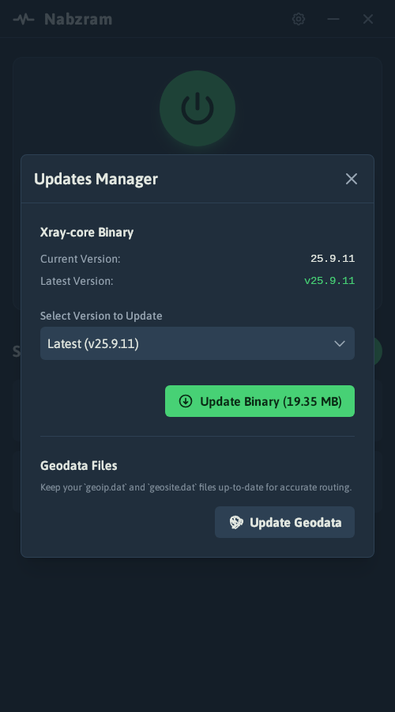
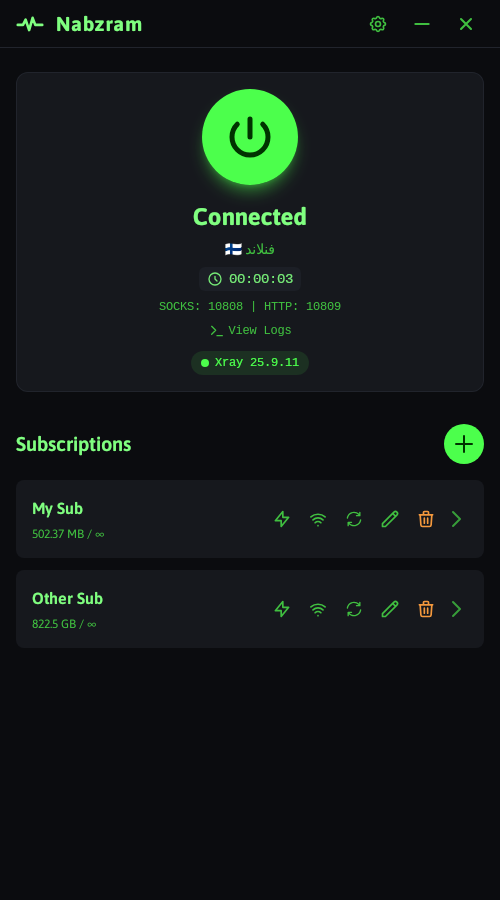

<div align="center">
  

# Nabzram

</div>

<div align="center">

*A Marzban client tool for connecting to Marzban subscriptions, born out of pure boredom and built with whatever tech stack was lying around* 🤷🏻‍♂️

</div>

> This entire project, including the logo, components, app architecture, and even this README you're reading right now, was crafted by AI. Well, except the name "Nabzram" - that was my brilliant idea! 😮‍💨 I was bored one day, had some subscriptions to use, and thought "why not?" So here we are - a desktop app that actually does exactly what it needs to do, and it works!

A modern GUI application for managing and connecting to **Marzban subscription servers**. Built with Python and React, wrapped in a native desktop application using pywebview.

> **Important**: This app is made specifically for Marzban subscriptions. It runs Xray-core and exposes SOCKS/HTTP proxies to your system. **System-wide proxy configuration is now supported** - TUN interface is not yet implemented.


## Download

**Ready to use:** Download the latest release from [GitHub Releases](https://github.com/gozargah/nabzram/releases)  
No installation required – just run the executable for your platform!

### Direct Download Links

| Platform / File | Download |
|-----------------|----------|
| **Linux (64-bit)** | [nabzram-linux-x86_64](https://github.com/gozargah/nabzram/releases/latest/download/nabzram-linux-x86_64) |
| **Linux (ARM 64-bit)** | [nabzram-linux-arm64](https://github.com/gozargah/nabzram/releases/latest/download/nabzram-linux-arm64) |
| **macOS (64-bit)** | [nabzram-macos-x86_64.zip](https://github.com/gozargah/nabzram/releases/latest/download/nabzram-macos-x86_64.zip) |
| **macOS (ARM 64-bit)** | [nabzram-macos-arm64.zip](https://github.com/gozargah/nabzram/releases/latest/download/nabzram-macos-arm64.zip) |
| **Windows (64-bit)** | [nabzram-windows-x86_64.exe](https://github.com/gozargah/nabzram/releases/latest/download/nabzram-windows-x86_64.exe) |
| **Debian/Ubuntu (64-bit)** | [nabzram_25.10.0117_amd64.deb](https://github.com/gozargah/nabzram/releases/latest/download/nabzram_25.10.0117_amd64.deb) |
| **Debian/Ubuntu (ARM 64-bit)** | [nabzram_25.10.0117_arm64.deb](https://github.com/gozargah/nabzram/releases/latest/download/nabzram_25.10.0117_arm64.deb) |

## Features

- **📱 Modern UI**: Clean, responsive interface with dark theme
- **🔧 System Tray**: Minimize to system tray with quick access
- **🔗 Marzban Integration**: Add and connect to Marzban subscription servers
- **🌐 System-wide Proxy**: Automatically configure proxy to your system
- **🎨 Customizable Settings**: Configure Xray paths, ports, and appearance preferences
- **🖥️ Cross-Platform**: Native desktop app supporting Windows, macOS, and Linux

## Screenshots

<div style="overflow-x: auto; white-space: nowrap;">
  
  
  
  
  
  
</div>

## Build from Source

### Prerequisites

- **Python 3.12+**
- **UV**: For managing Python versions and dependencies
- **Xray-core**: Optional - app will download it for you if not found
- **Bun**: For frontend development (recommended) or Node.js

**Supported Platforms**: Windows, macOS, and Linux

### System Dependencies

#### Linux (Ubuntu/Debian)
```bash
sudo apt-get update
sudo apt-get install -y \
  pkg-config build-essential python3-dev \
  libcairo2-dev libgirepository1.0-dev \
  libgtk-3-dev libwebkit2gtk-4.1-dev
```

#### Windows
- No additional system dependencies required
- Xray-core will be automatically downloaded if not found

#### macOS
- No additional system dependencies required
- Xray-core will be automatically downloaded if not found

### Install Xray-core (Optional)

The app can automatically download Xray-core if not found, but you can also install it manually:

#### Linux
```bash
# Download and install Xray-core
bash <(curl -L https://github.com/XTLS/Xray-install/raw/main/install-release.sh)
```

#### Windows
- Download from [Xray releases](https://github.com/XTLS/Xray-core/releases)
- Or let Nabzram download it automatically

#### macOS
```bash
# Using Homebrew
brew install xray

# Or download manually from releases
```

**Note**: If Xray-core is not installed, the app will prompt you to download it automatically on first run.

### Install UV

Follow instructions at [astral.sh/uv](https://astral.sh/uv/)

### Python Installation

1. **Clone the repository**
   ```bash
   git clone https://github.com/gozargah/nabzram.git
   cd nabzram
   ```

2. **Install Python dependencies**
   ```bash
   uv sync
   ```

3. **Run the application**
   ```bash
   uv run main.py
   ```

## Development

### Frontend Development

The frontend is built with React, TypeScript, and Vite:

```bash
cd ui
bun install
bun run dev
```

The development server will start on `http://localhost:5173` and automatically reload on changes.

### Backend Development

The backend uses a modular architecture with operations and services:

```bash
# Run the main application
uv run main.py

# The application uses pywebview to create a native desktop window
# No separate server process needed - everything runs in the main process
```

**Note**: The application uses pywebview's built-in HTTP server for the frontend-backend communication.

### Building Executable

Build a standalone executable using Nuitka:

```bash
uv run build.py
```

This will:
1. Build the React frontend using Vite
2. Compile the Python application with Nuitka
3. Create a single executable file in the `dist/` directory

The build script automatically handles:
- Frontend dependency installation and building
- Nuitka installation if not present
- Platform-specific optimizations (Windows, macOS, Linux)
- Icon and asset bundling

## Configuration

### Environment Variables

Copy `env.example` to `.env` and modify as needed:

```bash
cp env.example .env
```

Available options:
- `DATABASE_PATH`: Database file location (default: user data directory)
- `DEBUG`: Enable debug mode (default: false)

### Settings

Configure the application through the Settings modal:
- **Xray Binary Path**: Custom path to Xray executable
- **Assets Folder**: Xray assets directory
- **SOCKS Port**: Default SOCKS proxy port
- **HTTP Port**: Default HTTP proxy port

## Usage

### Adding Marzban Subscriptions

1. Click the **"+"** button to add a new subscription
2. Enter a name and your Marzban subscription URL (must support `/v2ray-json` endpoint)
3. The app will automatically fetch and parse server configurations
4. Servers will appear in the subscription list

### Connecting to Servers

1. Select a subscription to view its servers
2. Click on a server to connect
3. Monitor connection status and logs
4. Use the disconnect button to stop the connection

**Note**: Connections expose SOCKS and HTTP proxies to your system. You'll need to configure your applications to use these proxies manually - no system-wide proxy or TUN interface is configured.

## Architecture

### Backend (Python)
- **PyWebview**: Desktop application wrapper with built-in HTTP server
- **TinyDB**: Local database for subscriptions and settings
- **Xray-core**: Proxy protocol implementation

### Frontend (React)
- **React 19**: UI framework
- **TypeScript**: Type safety
- **Vite**: Build tool and dev server
- **Tailwind CSS**: Styling (via CDN)

### Project Structure
```
app/
├── gui/           # GUI management and window APIs
├── ops/           # Core operations (logs, servers, settings, etc.)
├── services/      # Business logic services
├── models/        # Data models and schemas
└── database/      # Database management
```

## Supported Protocols

- **VMess**: V2Ray protocol
- **VLESS**: V2Ray protocol variant
- **Trojan**: Trojan protocol
- **Shadowsocks**: Shadowsocks protocol
- **HTTP/HTTPS**: HTTP proxy
- **SOCKS**: SOCKS proxy

## Contributing

1. Fork the repository
2. Create a feature branch
3. Make your changes
4. Add tests if applicable
5. Submit a pull request

## License

This project is licensed under the GNU General Public License v3.0 (GPL-3.0). See the [LICENSE](LICENSE) file for full terms.

- No warranty is provided, express or implied (see Sections 15–16).
- If you distribute modified versions, you must release the source code under GPL-3.0.
- Please include attribution by mentioning that your project is a fork of `Nabzram` and link back to this repository.

## Acknowledgments

- [Xray-core](https://github.com/XTLS/Xray-core) - Proxy protocol implementation
- [React](https://reactjs.org/) - UI library
- [PyWebview](https://github.com/r0x0r/pywebview) - Desktop wrapper
- [TinyDB](https://tinydb.readthedocs.io/) - Lightweight database
- [Nuitka](https://nuitka.net/) - Python compiler for standalone executables

## API Documentation

For detailed API documentation, see [docs/API.md](docs/API.md). This document covers all available methods exposed to the frontend via `window.pywebview.api`.

## Support

- **Issues**: [GitHub Issues](https://github.com/Gozargah/Nabzram/issues)
- **Discussions**: [GitHub Discussions](https://github.com/Gozargah/Nabzram/discussions)
- **Documentation**: [Wiki](https://github.com/Gozargah/Nabzram/wiki)
